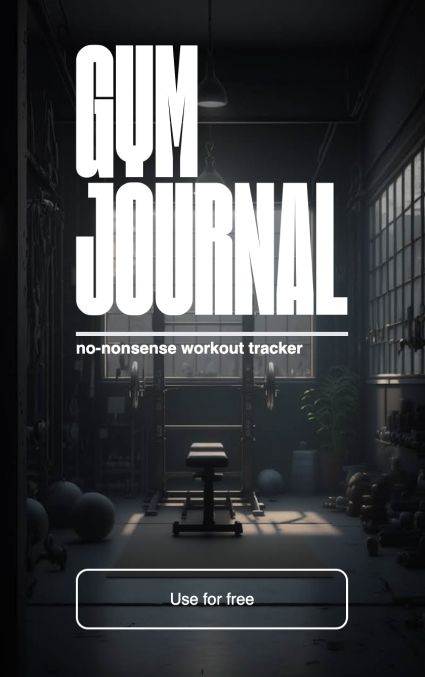
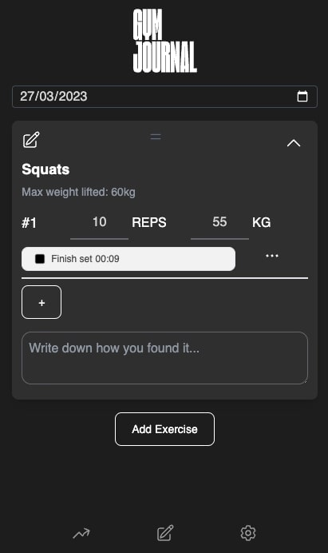
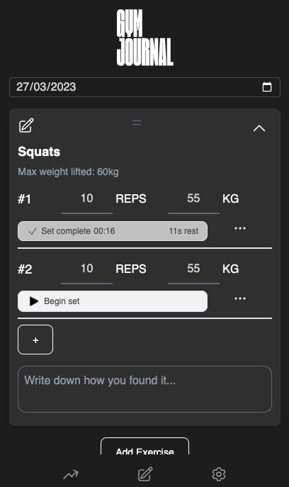
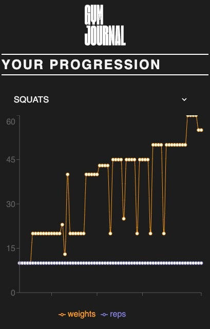

<h1 align="center">gymjournal.co.uk</h1>

 

<h2>About the project</h2>

My friends and I wanted an app to track our workout progress but are frustrated with the options on the market.

So I built GymJournal. A no-nonsense workout tracker. 

<h2>Built with</h2>

 React, Typescript, Tailwind CSS, React Router, and Firebase Realtime Database.

<h2>Features </h2>
<h3>Track: weight, reps, set duration</h3>

 

<h3>Track: rest time</h3>

 

<h3>Visualise: workout progress</h3>

 

